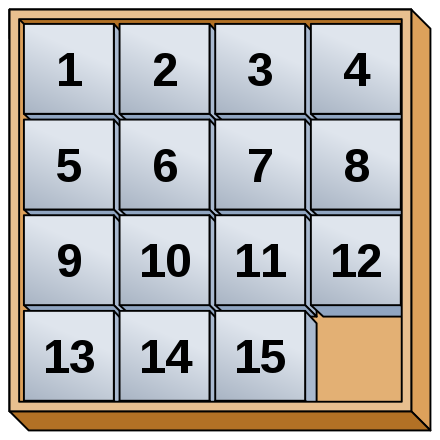

# Taquin (8-puzzle)

The famous sliding tiles game implemented in **Prolog**
using A* graph search algorithm for N×M size puzzles.



# Usage

The code is implemented for [SWI Prolog](https://www.swi-prolog.org/) environment.

Run the following command in your shell (provided you have SWI Prolog installed):
```sh
swipl test_3x3.pl
```
You can also try `test_3x4.pl` or `test_4x4.pl`.

Then run in your prolog console the following query
```prolog
puzzle(Puzzle, Difficulty), testPuzzle(Puzzle, ?Algorithm, ?Heuristic).
```
- The `Heuristic` value can be ommitted, the program would call the most adapted
heuristic for the chosen algorithm (recommended).
- The `Algorithm` can be ommitted, the default value is `astar`.

# Search Algorithms

- **Depth-First Search (DFS):** a simple implementation of DFS using prolog's search trees,
  there is no optimality guaranty, probable overflow because of the lack of depth control.
- **Iterative Deepening DFS (ID-DFS):** analog to DFS with a given Depth, starts with an
  underestimate of the optimal depth (an admissible heuristic)
  and increments the depth successively until a solution is found.
  Optimality is guarantied, however it can be slow for complex puzzles.
  Nevertheless, no overflow problems as the algorithm does not keep track of paths.
- **Greedy Search:** a simple greedy algorithms that chooses each step by minimizing a
  heuristic (admissible or not), there is no optimality guaranty but the algorithm
  is fast and finds a solution for all 3x3 puzzles with the `m3h` heuristic,
  possible overflow for complex puzzles because of th lack of depth control.
- **A\* Search:** a rigourous A* implementation using a priority queue that is guarantied
  to find an optimal solution with an admissible heuristic *manhattan* or *hamming*.
  Is relatively slow, but is significantly faster and more performant in the case
  of complex puzzles.

The code is well-documented and readable,
for more details the report is in [docs/book.pdf](https://rand-asswad.github.io/taquin)
written in French (as the project is part of Masters program at INSA Rouen).

# To-Do List

- Implement IDA\*
- Implement random puzzle generator
- Implement comparison (time and solution optimality-wise)
